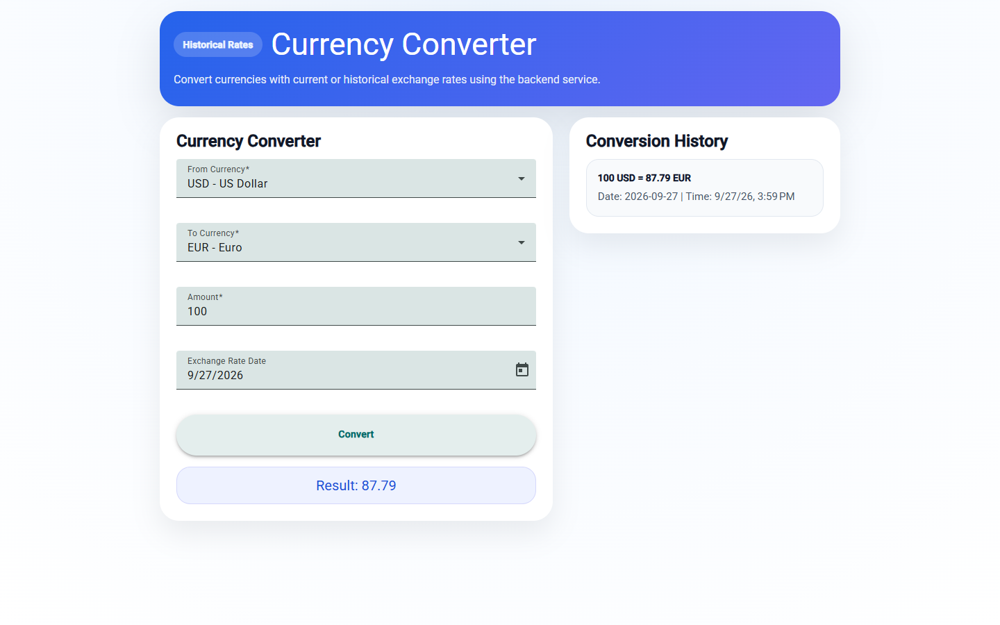
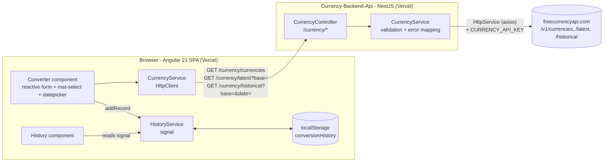

# Currency App

[](https://github.com/Sami123d/Currency-App/actions/workflows/ci.yml)

An Angular 21 + Angular Material currency converter that uses current or historical exchange rates. Rates come from my NestJS backend ([Currency-Backend-Api](https://github.com/Sami123d/Currency-Backend-Api)), which proxies [freecurrencyapi.com](https://freecurrencyapi.com).

**Live demo:** https://currency-app-psi-self.vercel.app (checked 2026-09-27: the currency list loads, and both a latest-rate and a historical-rate (2025-01-02) USD to EUR conversion complete)



## Status

A small, working portfolio project with one screen: the converter plus a conversion-history panel. There is no routing, no authentication and no server-side persistence.

## Features

- **Currency list from the backend.** On load the app calls `GET /currency/currencies` and fills the From/To Material selects (about 33 currencies, whatever freecurrencyapi.com supports).
- **Latest or historical rates.** If the selected date is today (in local time), the app calls `GET /currency/latest?base=FROM`. For any other date it calls `GET /currency/historical?base=FROM&date=YYYY-MM-DD`. Either way, the result is `amount × rate[TO]`. The datepicker won't let you pick a future date.
- **Conversion history.** Each successful conversion is added to the top of a signal-based `HistoryService` and saved to `localStorage` under the key `conversionHistory`, so it survives a page reload. It only lives in that browser.
- **Error feedback.** If the currency list or a conversion fails, an inline alert is shown. Before, errors were only logged to the console.
- Reactive form validation: both currencies are required and the amount must be at least 0.01.

## Architecture



The frontend never talks to freecurrencyapi.com directly, so the API key stays on the server.

## Tech stack

Angular 21 (standalone components, signals), Angular Material 21, RxJS, Tailwind CSS 4 (via PostCSS), Vitest + jsdom (through `@angular/build:unit-test`). Deployed on Vercel.

## Project structure

```
src/
  app/
    components/converter/   form, API calls, rate selection, error display
    components/history/     renders HistoryService records
    services/currency.service.ts   HttpClient wrapper for the backend
    services/history.ts            signal + localStorage persistence
  environments/             apiUrl per build configuration
```

## Getting started

Requires Node 20.19+ (or 22.12+).

```bash
npm install
npm start          # ng serve on http://localhost:4200
```

The development build calls `http://localhost:3000/currency`, so run [Currency-Backend-Api](https://github.com/Sami123d/Currency-Backend-Api) locally too, or point `src/environments/environment.ts` at the deployed API.

## Configuration

Angular has no runtime env vars here. The backend URL is set at build time:

| File | `apiUrl` | Used by |
| --- | --- | --- |
| `src/environments/environment.ts` | `http://localhost:3000/currency` | `ng serve` / development build |
| `src/environments/environment.prod.ts` | `https://currency-backend-api.vercel.app/currency` | `ng build` (production, swapped in via `fileReplacements`) |

## Backend endpoints used

| Method | Path | Purpose |
| --- | --- | --- |
| GET | `/currency/currencies` | Currency codes and names |
| GET | `/currency/latest?base=USD` | Latest rates for a base currency |
| GET | `/currency/historical?base=USD&date=2025-01-02` | Rates on a past date |

See the [backend README](https://github.com/Sami123d/Currency-Backend-Api#api-reference) for response shapes and error codes.

## Testing

```bash
npx ng test --watch=false
```

There are 12 Vitest specs. They check that currency loading maps the backend payload, that `/latest` is used for today and `/historical` for past dates, that conversions are recorded in history, that load and convert failures show an error, that an invalid form sends no request, and that history persists to `localStorage` and renders. HTTP is mocked with `HttpTestingController`. CI runs the tests and a production build on every push and PR.

## Deployment

The app is deployed on Vercel using its Angular framework preset, which runs `ng build` with the production configuration. There is no `vercel.json`. Pushing to `master` triggers a deploy.

## Roadmap / known limitations

- The initial bundle is about 720 kB, which is over the 500 kB warning budget. Most of it is Angular Material and the datepicker.
- History can't be cleared from the UI and grows without limit.
- Nothing is cached on the client or the server, so every conversion calls the provider.
